#  Shoe Shop Management System

The Shoe Shop Management System offers a range of features to enhance the order process.

🎗️𝗧𝗲𝗰𝗵𝗻𝗼𝗹𝗼𝗴𝘆 𝘀𝘁𝗮𝗰𝗸

Front End :

☑️HTML
☑️CSS
☑️JavaScript
☑️JQuery
☑️AJAX
☑️CSS-Frameworks

Back End :

☑️Spring Boot
☑️Spring Web MVC
☑️Spring Data
☑️Spring Security
☑️Spring Validation
☑️Lombok
☑️Model Mapper
☑️Jackson
☑️MySQL
☑️JWT
☑️Layered Architecture

## Features

- Main Page

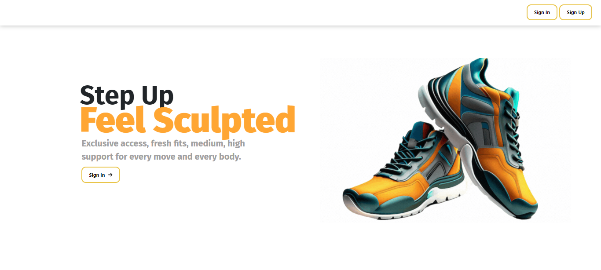

- Sign In Page

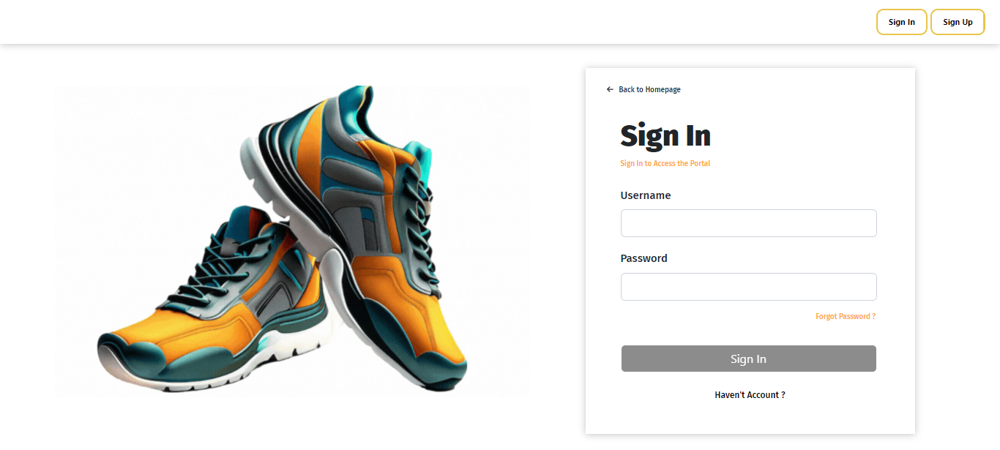

- Sign Up Page

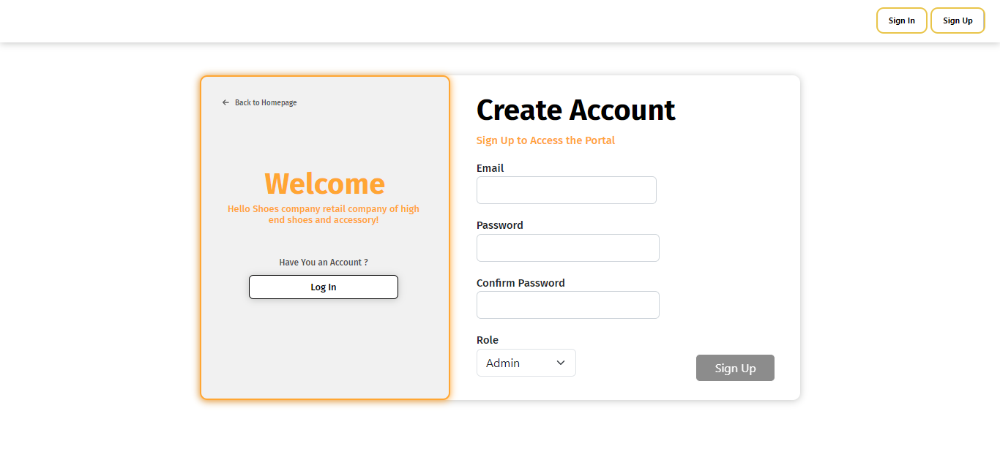

### Admin Features
- Admin Panel Dashboard

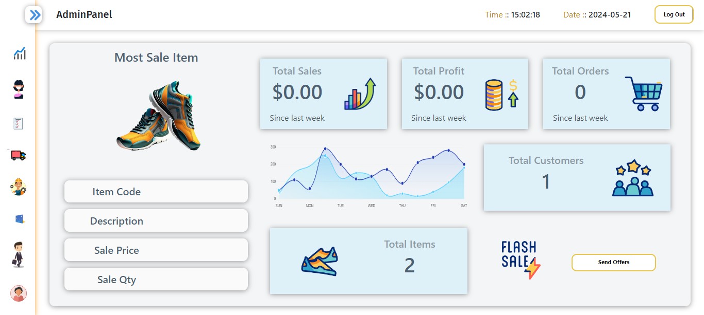

- Send Offers

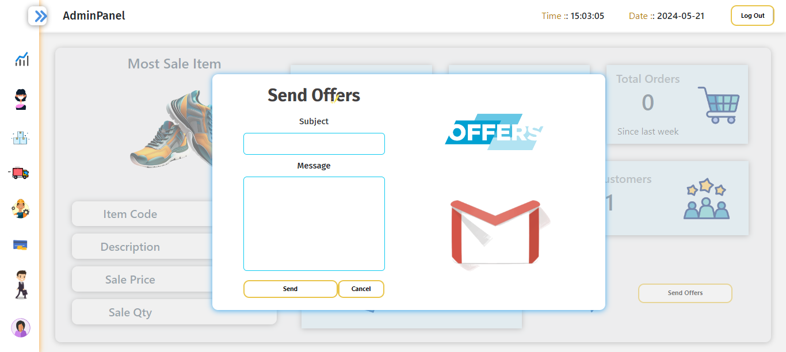

- Customers Manage

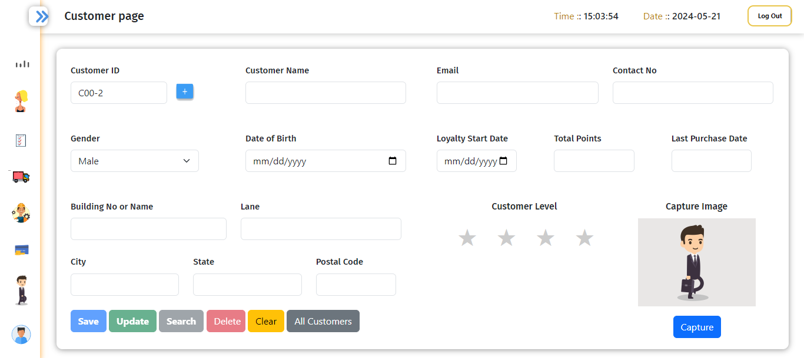

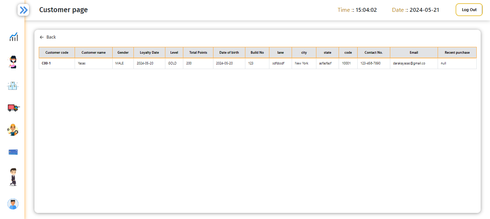

- Inventory Manage

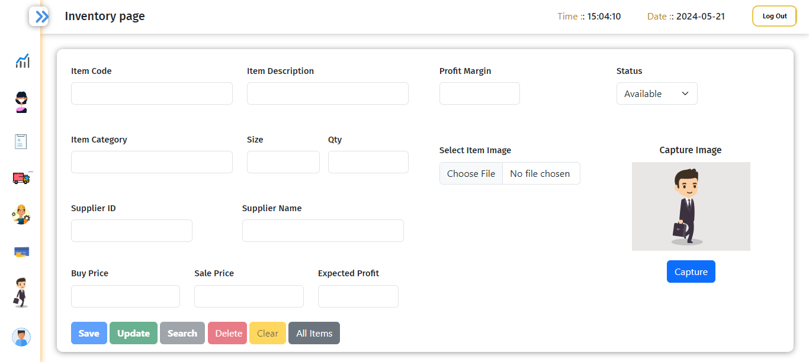

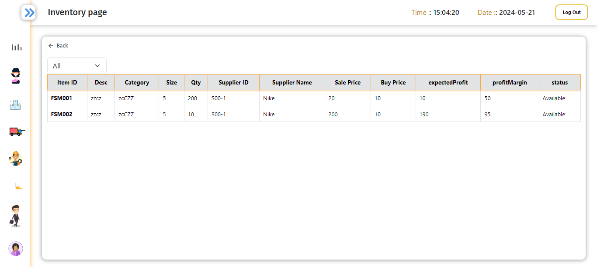

- Supplier Manage 

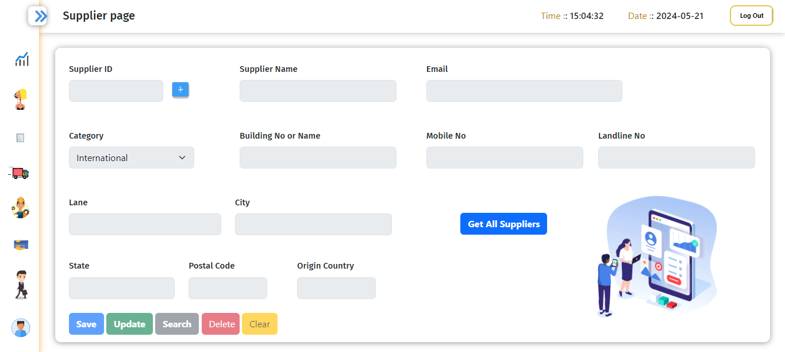

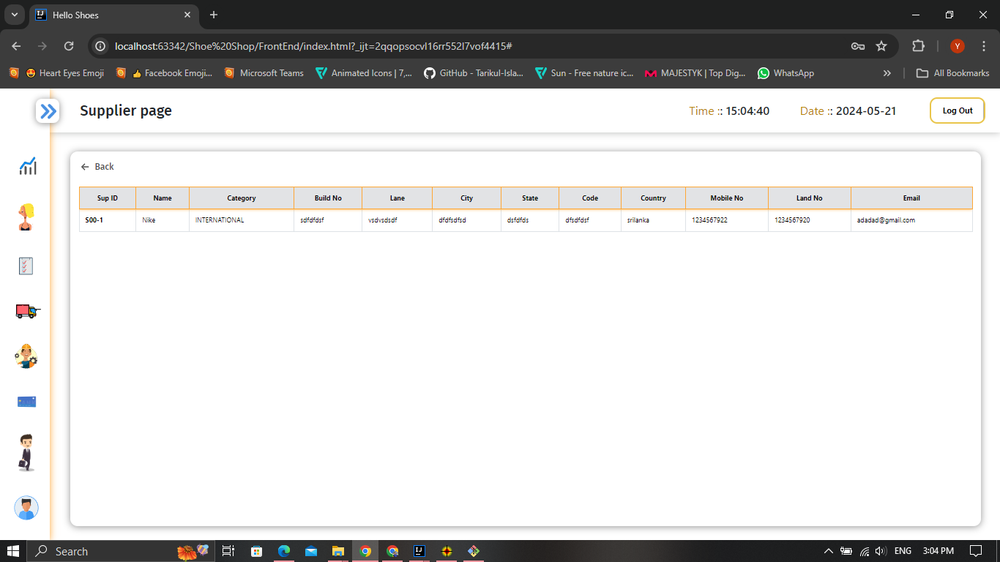

- Employee Manage

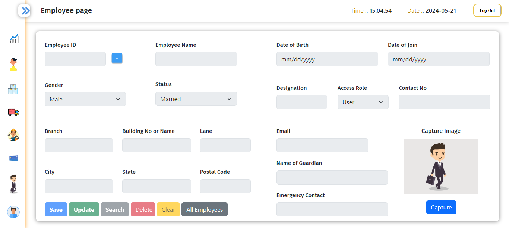

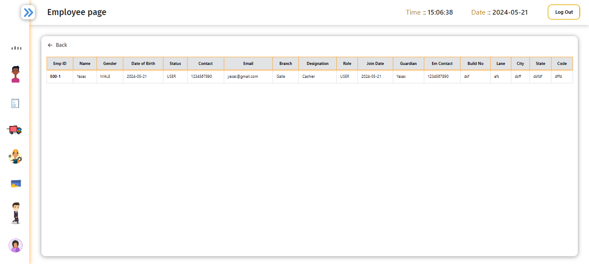

- Sales Manage

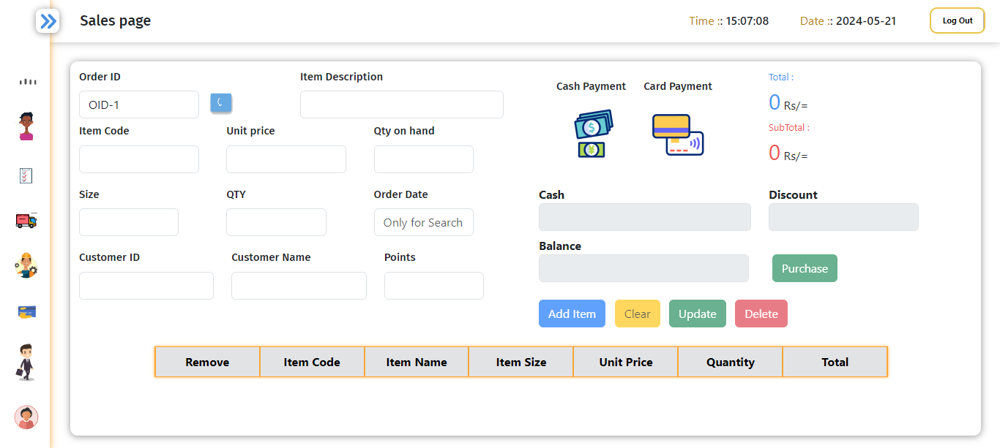

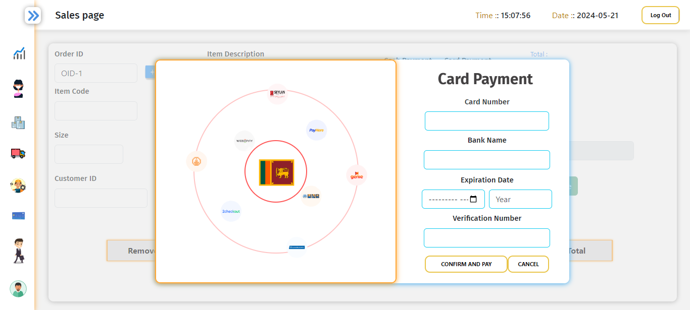

- Admins Manage

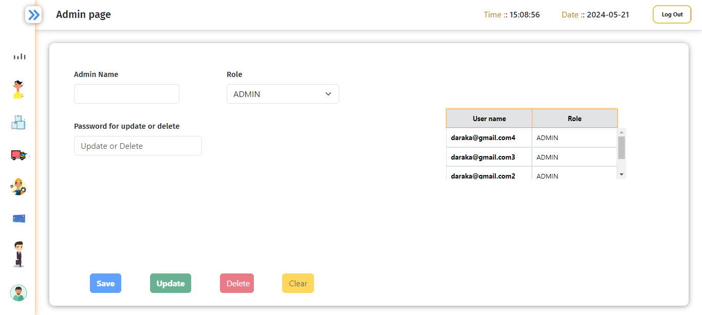

- Users Manage

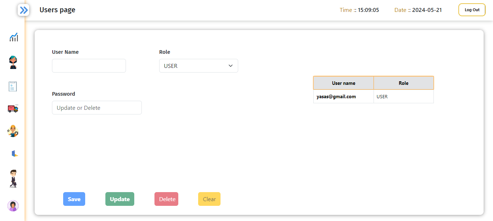

### User Features

Limit access to users

- User Dashboard

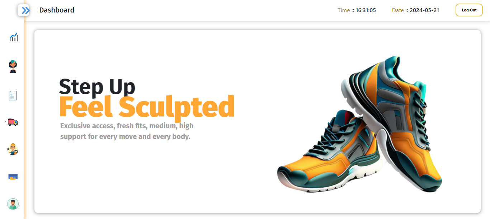

- Others

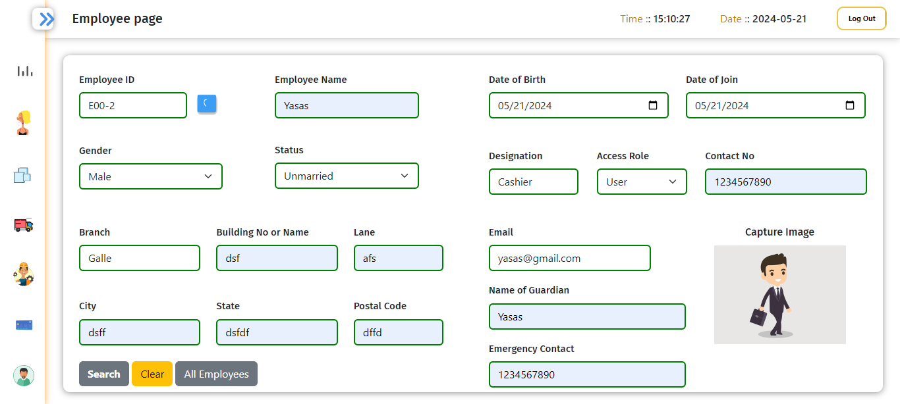

### Notifications

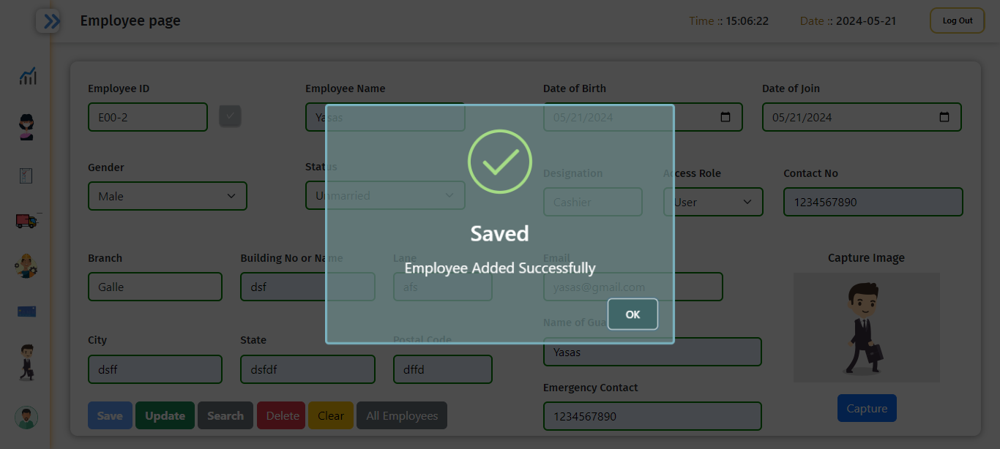